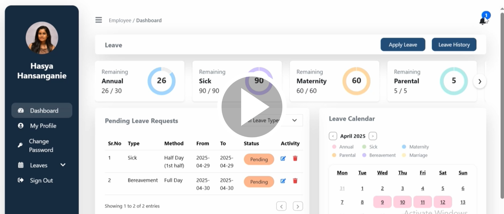

# Employee Leave Management System

A web-based platform for managing employee leave requests and approvals, designed to streamline HR operations and enhance employee experience.

## 📽️ Demo Video

  

## 📝 Project Description

This system provides a seamless interface for both HR personnel and employees:

- **HR Features**:
  - Department Management: Add, edit, and delete departments within the organization.
  - Leave Type Management: Create, update, and remove different leave types (e.g., annual leave, sick leave).
  - Employee Management: Add, edit, and delete employee profiles.
  - Leave Request Management: View, approve, or reject employee leave requests.
  - Leave Balance Tracking: Monitor and update individual employee leave balances.
  - Dashboard Overview: Access real-time statistics on leave usage, pending requests, and employee leave summaries. 

- **Employee Features**:
  - Employee Dashboard: View a personal dashboard displaying available leave balance, leave history, and status of recent leave requests.
  - Leave Balance Viewing: Check current available leave days and review past leave records.
  - Leave Request Submission: Submit new leave requests by selecting leave type, duration, and providing a reason.
  - Leave Request Tracking: Monitor the status of submitted leave requests (Pending, Approved, Rejected).
  - Profile Management: Update and maintain personal profile information.
  - User-Friendly Interface: Navigate the system easily with a responsive and intuitive user experience. 

The platform enhances transparency, automates manual processes, and ensures accurate leave tracking within organizations.

## 🚀 Tech Stack

- **Frontend**: React, Bootstrap, JavaScript, Axios  
- **Backend**: Node.js, Express.js  
- **Database**: MySQL  
- **APIs**: RESTful API architecture  
- **Authentication**: JSON Web Token (JWT), bcrypt.js
